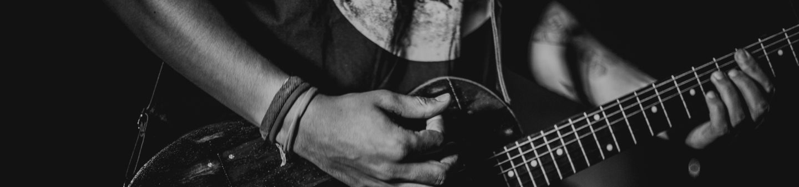
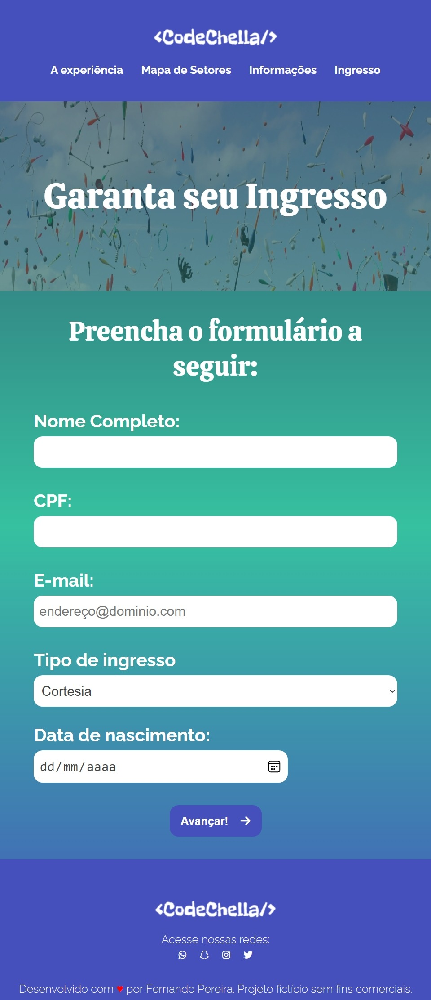
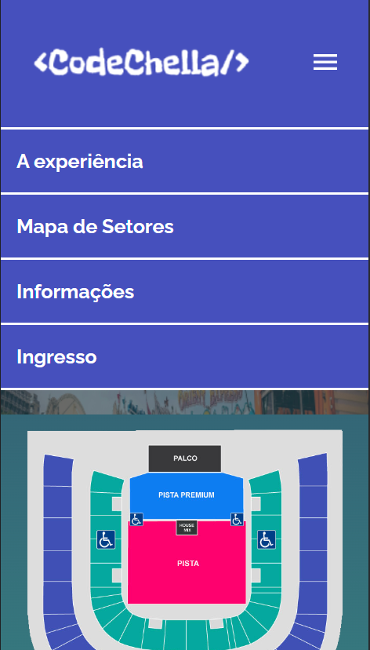
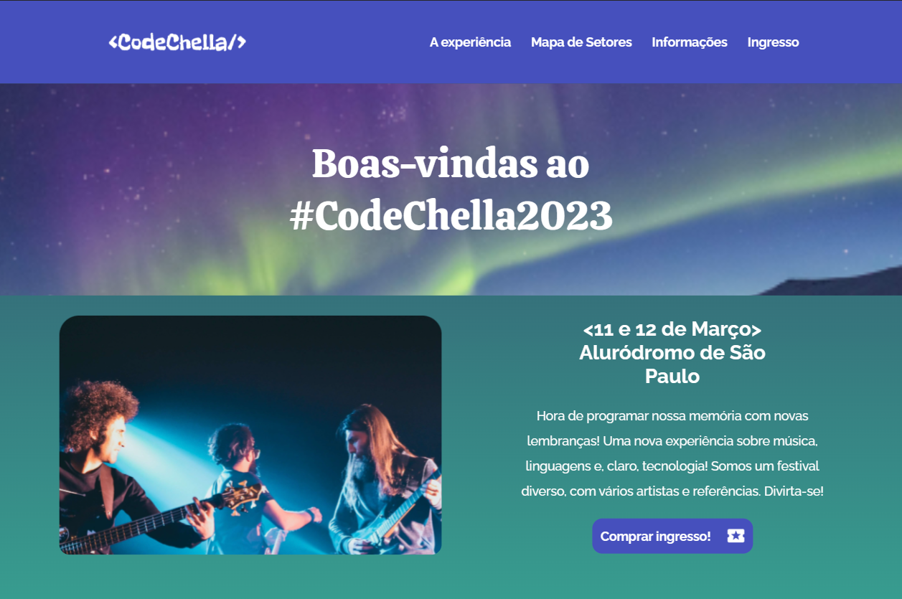

# CodeChella Project - A Eden for Devs

  

  

A full responsive website from a ficticious festival called CodeChella. This project takes part from studies in Alura challenge!

> ## Functionalities 

* Check all the information about festival location, date and setlist.

* Make your register and getting your ticket.

* Receive a detailed description about experience organization and proposal about this festival 

> ## To run this project 

You just need a browser to run this project, you can do this [here](projeto-codechella-indol.vercel.app) or make a clone on my [Github](https://github.com/Feehh32/projeto-codechella)  

> ## Sreenshots

  
  
  

> ## Technologies

* `` CSS ``

* ``HTML``

* ``Javascript``

